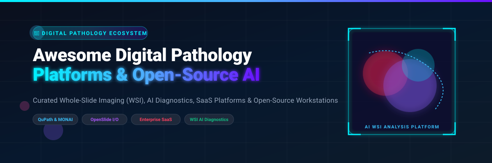

  

# 🔬 Awesome Digital Pathology Platform 🚀

  
  
  
  
  
  

## 🌐 Top Digital Pathology Platform & Computational Pathology Ecosystem 🧬

**Curated List of Enterprise SaaS Products & Open-Source GitHub Projects for Whole-Slide Imaging (WSI), AI Cancer Diagnostics & Quantitative Tissue Analysis** 🧪

*Focused on Whole-Slide Imaging (WSI), Computational Pathology, AI Diagnostics, Viewer Workstations, and Deep Learning Bioimage Pipelines* 📊

📅 **Last updated: October 2026**

---

### 💡 Overview & Market Insights 🔍

This repository tracks notable **SaaS platforms** and **open-source projects** for **Digital Pathology**. These software ecosystems manage whole-slide images (WSI), support primary diagnostic workflows, automate biomarker quantification, and integrate deep learning AI models for oncology research and clinical decision support.

> 📈 **Market Size & Fragmented Sector Dynamics**:  
> The global digital pathology market size is estimated at **~$1.46 Billion in 2024–2026** and projected to reach **~$2.9 Billion by 2030** (growing at a CAGR of ~12.5%).  
> The sector is **moderately to highly fragmented**—spanning mega diagnostic conglomerates (Roche, Danaher/Leica, Philips, Hamamatsu) acquiring specialized AI vendors, alongside independent software solutions (Proscia, Indica Labs) and a vibrant open-source research ecosystem (QuPath, MONAI, OpenSlide).

---

## 📑 Table of Contents
- [🏢 Enterprise SaaS & Hosted Platforms](#-enterprise-saas--hosted-platforms)
- [🔓 Open-Source GitHub Projects](#-open-source-github-projects)
- [🧩 Composable Open Architecture Stacks](#-composable-open-architecture-stacks)
- [🤝 How to Contribute](#-how-to-contribute)
- [💖 Support & Sponsorship](#-support--sponsorship)
- [📈 Star History](#-star-history)
- [⚠️ Disclaimer](#%EF%B8%8F-disclaimer)

---

## 🏢 Enterprise SaaS & Hosted Platforms

| Platform / Vendor | Company Size (Valuation / Revenue) | Starting Pricing (Specific Tier) | Free Tier / Trial Limit | Key Focus & Features |
| :--- | :--- | :--- | :--- | :--- |
| **[Roche Navify Pathology](https://www.roche.com/)** 🏥 | **~$348B Market Cap** (Group Revenue: CHF 61.5B / ~$68B) | $15,000 / year (Enterprise Base Station software license starting tier) | 30-day full feature interactive demonstration trial for enterprise labs | Enterprise digital pathology platform, LIS integration, scanner connectivity, & integrated AI algorithm suite. |
| **[Leica Aperio (Danaher)](https://www.leicabiosystems.com/)** 🔬 | **~$160B Market Cap** (Danaher Revenue: $23.9B/yr) | $12,500 / year (Aperio eSlide Manager software starter tier) | 14-day interactive software trial limit upon request | Whole-slide scanners (GT 450) and integrated slide management workstation software. |
| **[Philips IntelliSite](https://www.philips.com/)** ⚡ | **~$24B Market Cap** (Annual Sales: €17.8B / ~$20.6B) | $18,000 / year (IMS software platform baseline software license) | 30-day clinical demonstration trial for institution pathology departments | IVD-cleared primary diagnostic WSI platform and enterprise image management system (IMS). |
| **[Hamamatsu NanoZoomer](https://www.hamamatsu.com/)** 📸 | **~$4.5B Market Cap** (Annual Revenue: ¥321.5B / ~$2.2B) | $8,500 / year (NZConnect / viewer software workstation license) | 30-day evaluation trial license for NZConnect software suite | High-throughput whole-slide scanners and viewer/management server software. |
| **[PathAI (AISight)](https://www.pathai.com/)** 🧠 | **$1.05B Valuation** (Acquired by Roche 2026; Raised $255M) | $2,500 / month ($30,000/yr starting AISight SaaS facility tier) | 14-day / 50-slide trial limit on AISight platform demo environment | AI-first clinical computational pathology platform, biomarker quantification, & clinical trial support. |
| **[Proscia (Concentriq)](https://proscia.com/)** ☁️ | **$130M Total Funding** (Raised $50M Series C in 2025; ~$16.4M Rev) | $1,250 / month ($15,000/yr Concentriq Cloud base seat package) | 14-day free trial on Concentriq Cloud (max 100 WSI slide uploads) | Vendor-neutral enterprise digital pathology image management platform (Concentriq). |
| **[Ibex Medical Analytics](https://ibex-ai.com/)** 🎯 | **$200M Valuation** (Raised $116.6M; ~$15.8M ARR) | $1,500 / month ($18,000/yr Galen Prostate/Breast AI starting tier) | 30-day trial license (up to 200 clinical case evaluations) | AI diagnostics for cancer detection (Galen Prostate, Breast, Gastric) and quality control. |
| **[Paige (Tempus AI)](https://paige.ai/)** 🩺 | **$81.25M Valuation** (Acquired by Tempus 2025; Raised $247M) | $1,800 / month ($21,600/yr Paige FullFocus/AI starting tier) | 14-day trial on Paige FullFocus viewer (max 50 WSI slide uploads) | FDA-cleared AI diagnostic viewer (FullFocus) and AI models for prostate and breast cancer. |
| **[Visiopharm](https://visiopharm.com/)** 🧪 | **~$75M Valuation** (Acquired by Grundium 2026; Raised $29M) | $1,200 / month ($14,400/yr On-Premise/Cloud starter seat) | 30-day evaluation license (includes sample image analysis app bundle) | Precision pathology, AI tissue mining, cell segmentation, & quantitative multiplex analysis. |
| **[Aiforia Technologies](https://www.aiforia.com/)** 💻 | **~$39M Market Cap** (Nasdaq Helsinki: AIFORIA; ~$10.1M Rev) | $500 / month ($6,000/yr Aiforia Create / Clinical starter plan) | Free forever plan with 5 GB storage & 5 deep learning models; 30-day trial for Create | Cloud-based deep learning AI platform for slide analysis, custom model training, & image management. |
| **[Gestalt Diagnostics](https://gestaltdiagnostics.com/)** 👁️ | **$35M Valuation** (Raised $14.1M; Series A in 2025; ~$3M Rev) | $950 / month ($11,400/yr PathFlow SaaS baseline seat package) | 30-day free trial on PathFlow platform (max 50 WSI slide uploads) | PathFlow enterprise interoperable digital pathology viewer with LIS & AI integration. |
| **[Deep Bio (DeepDx)](https://www.deepbio.co.kr/)** 🔬 | **$14M Valuation** (Raised $6M+ Series A; Korean AI Pioneer) | $800 / month ($9,600/yr DeepDx Prostate SaaS starter tier) | 14-day free trial limit on DeepDx web workspace (up to 30 WSI uploads) | Deep learning-based automated cancer analysis software (DeepDx Prostate Gleason grading). |
| **[Indica Labs (HALO AP)](https://indicalab.com/)** 📊 | **Privately Held & Profitable** (Leica Strategic Investor 2025) | $1,500 / month ($18,000/yr HALO AP base cloud software license) | 30-day evaluation software trial (includes 1 HALO AI algorithm module) | Quantitative pathology, HALO AP slide management, and AI biomarker evaluation. |
| **[Inspirata (Fujifilm Dynamyx)](https://www.fujifilm.com/)** 🌐 | **Acquired by Fujifilm** (Division acquired in 2023) | $1,000 / month ($12,000/yr Dynamyx baseline SaaS software tier) | 30-day demonstration environment trial for clinical health systems | Enterprise digital pathology platform (Dynamyx) for diagnostic workflows. |

---

## 🔓 Open-Source GitHub Projects

Below is the curated list of open-source bioimage software, whole-slide imaging libraries, and computational pathology deep learning frameworks, **sorted descending by GitHub Stars_Count** ⭐:

1. **[MONAI](https://github.com/Project-MONAI/MONAI)**  🩺  
   *PyTorch-based open-source framework for deep learning in healthcare imaging, featuring dedicated pathology models, WSI transforms, and segmentation pipelines.*

2. **[QuPath](https://github.com/qupath/qupath)**  🔬  
   *Leading open-source bioimage analysis software for digital pathology—interactive annotation, cell detection, tissue segmentation, machine learning, and Java/Groovy scripting.*

3. **[ASAP (Automated Slide Analysis Platform)](https://github.com/computationalpathologygroup/ASAP)**  💻  
   *Open fast C++ viewer and analysis platform for multi-resolution WSI—annotation tools, Python bindings, and seamless deep learning integration.*

4. **[TIAToolbox](https://github.com/TissueImageAnalytics/tiatoolbox)**  🧪  
   *Tissue Image Analytics toolbox for computational pathology in Python—WSI tile handling, nucleus classification, patch extraction, and pretrained deep learning pipelines.*

5. **[OpenSlide](https://github.com/openslide/openslide)**  ⚙️  
   *Foundational open-source C library and Python wrapper for reading multi-vendor whole-slide image formats (Aperio, Hamamatsu, Leica, TIFF, etc.).*

6. **[HistomicsTK / Digital Slide Archive](https://github.com/DigitalSlideArchive/HistomicsTK)**  📂  
   *Python & web toolkit for pathology image analysis, color normalization, stain unmixing, and web-based slide management (Kitware ecosystem).*

7. **[PathML](https://github.com/Dana-Farber-AIOS/pathml)**  🧠  
   *Unified Python framework developed by Dana-Farber for computational pathology—preprocessing, model training, stain normalization, and WSI analytics.*

8. **[Slideflow](https://github.com/slideflow/slideflow)**  🚀  
   *Deep learning toolkit for digital pathology—fast WSI tile extraction, TensorFlow/PyTorch model training, feature extraction, and uncertainty estimation.*

9. **[Histocartography](https://github.com/BiomedSciAI/histocartography)**  🕸️  
   *Graph-based computational pathology toolkit developed by IBM Research for modeling cell graphs, tissue architecture, and spatial histology relationships.*

10. **[OMERO](https://github.com/ome/openmicroscopy)**  🗄️  
    *Open Microscopy Environment enterprise image data management server—storing, organizing, viewing, and sharing high-content pathology images.*

11. **[Cytomine](https://github.com/cytomine/cytomine)**  🌐  
    *Open-source web platform for collaborative remote analysis of large-scale biomedical WSI images, collaborative annotation, and AI proofing.*

---

### 🧩 Composable Open Architecture Stacks

- **Analysis Workstation**: QuPath for interactive annotation, cell segmentation, and quantitative biomarker analysis.
- **I/O & Image Format Layer**: OpenSlide for reading vendor WSI proprietary formats (.svs, .ndpi, .mrxs, .tif).
- **Web Collaboration & Cloud Archive**: Cytomine or Digital Slide Archive / HistomicsTK.
- **Enterprise Image Data Management**: OMERO for institutional slide repositories and metadata indexing.
- **Deep Learning Pipelines**: MONAI, TIAToolbox, PathML, and Slideflow for model training and cell graph extraction.

---

## 🤝 How to Contribute

Contributions are very welcome! To add or update a digital pathology platform or open-source tool:

1. 🍴 Fork this repository.
2. 📝 Edit `README.md` following the table/badge structure.
3. 🔎 Ensure descriptions are factual and links point directly to official sites/repositories.
4. 🚀 Open a Pull Request with a short summary of changes.

---

## 💖 Support & Sponsorship

If you find this digital pathology resource valuable for your research, lab, or software projects, please consider supporting the project! ⭐

- 🌟 **Star this repository** to show your appreciation and boost visibility.
- 🔀 **Fork & Share** with fellow computational pathologists, bioimage researchers, and lab IT leaders.
- ☕ **Buy Me a Coffee**: Support ongoing maintenance on the [GitHub Sponsor Dashboard](https://github.com/sponsors/ishandutta2007).

---

## 📈 Star History

---

## ⚠️ Disclaimer

- This is a **community-curated list** for informational and research purposes—not an endorsement.
- Clinical digital pathology software is subject to medical device regulations (FDA IVD, CE-IVDR). Only cleared systems may be used for primary clinical diagnosis where required by law. Research tools (including open source) require formal clinical validation prior to diagnostic use.
- Whole-slide images contain sensitive health data—always adhere to HIPAA, GDPR, and institutional data privacy protocols.

---

  <b>Made for Pathologists, Computational Pathology Researchers, Bioimage Analysts, and Lab IT Engineers 🔬✨</b>

